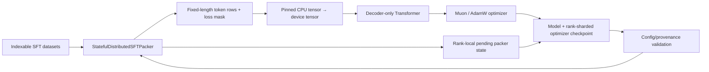

# Architecture and ownership

This repository is a systems-oriented fork of
[karpathy/nanochat](https://github.com/karpathy/nanochat). The upstream project
provides the Transformer, tokenizer, pretraining loop, distributed Muon/AdamW
optimizer, evaluation tasks, KV-cache inference engine, and web UI.

The portfolio work in this fork is deliberately concentrated in reproducible
SFT data processing and checkpoint compatibility instead of relabeling upstream
features as original work.

## Training and resume path

The checkpoint stores the packer state *before* the batch currently waiting to
be consumed. A resumed run reloads that state and regenerates the same pending
batch. Saving only a source cursor would be insufficient because buffer-based
best-fit packing prefetches conversations beyond the consumed position.
Model and optimizer tensors are written through same-directory temporary files;
rank 0 publishes a completion marker only after all ranks have reached the
checkpoint barrier and every expected shard exists.

## Stateful packer invariants

- Rank `r` owns source indices satisfying `index % world_size == r` in every
  epoch.
- Rank-local state contains the prefetched token buffer, epoch, cursor,
  configuration fingerprint, and metrics.
- A state can only be loaded under the same dataset size, rank topology,
  sequence length, batch size, strategy, and overflow policy.
- Overlength conversations follow an explicit `truncate` or `error` policy and
  are counted; they cannot create an infinite all-padding loop.
- Padding targets are assigned `ignore_index=-1`.
- Tokenizer supervision flags are packed alongside token IDs; user prompts,
  assistant delimiters configured as unsupervised, and tool outputs remain
  excluded from the next-token loss after packing and resume.
- DDP training requires a fixed optimization-step budget so every rank executes
  the same collectives.

## Packing policies

| Policy | Selection rule | Intended comparison |
|---|---|---|
| `sequential` | Only inspect the next buffered item | Minimal CPU overhead, more padding |
| `first_fit` | First item that fits | Moderate utilization and overhead |
| `length_bucket` | Best fitting coarse length bucket, FIFO within bucket | Approximate best-fit |
| `best_fit` | Longest item that fits exactly | Highest expected utilization |

CPU policy overhead is measured by
`benchmarks/benchmark_sft_packing.py`. End-to-end throughput, MFU, validation
BPB, and downstream accuracy must be measured with
`runs/sft_packing_ablation.sh`.

## Checkpoint compatibility

`nanochat/checkpoint_manager.py` detects legacy checkpoints missing residual
scalars or Value Embedding parameters. Missing tensors are created on the
requested device and checkpoint dtype. Value embeddings and gates are
zero-initialized so the added residual contribution is neutral at load time.

## Upstream versus fork changes

| Area | Origin |
|---|---|
| Decoder-only Transformer, RMSNorm, Value Embedding, sliding attention | Upstream |
| DDP-style distributed Muon/AdamW and base-training resume | Upstream |
| KV-cache inference, CLI, Web UI | Upstream |
| Device/dtype-aware legacy checkpoint patching | This fork |
| Exact rank-local SFT packing resume | This fork |
| Packing metrics, policies, tests, and ablation harness | This fork |
| Compiled/eager optimizer compatibility switch and parity tests | This fork |
| Run provenance/config hashes and A100 recipe | This fork |
